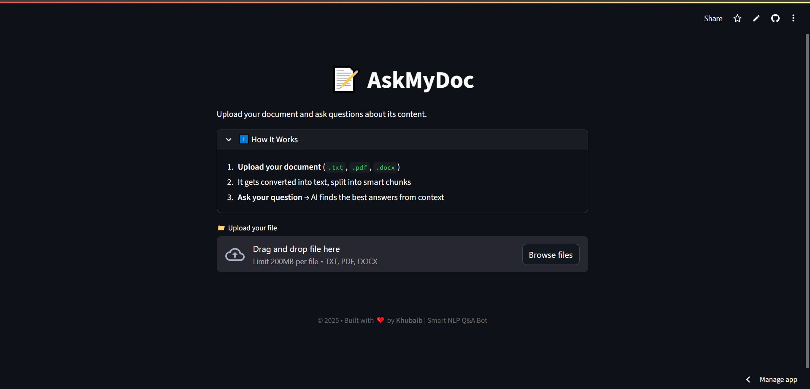
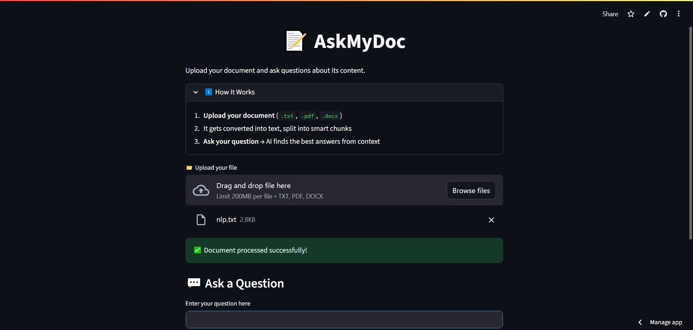
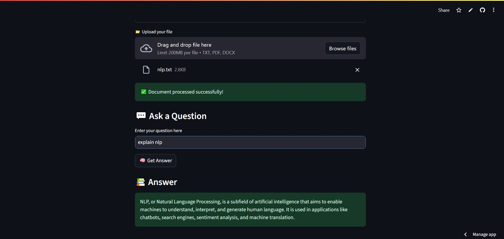

# 📄 AskMyDoc — Your AI-Powered Document Assistant

AskMyDoc is an intelligent chatbot that **answers your questions directly from your documents**.  
Upload PDFs, lecture notes, research papers, or any text-based file — AskMyDoc understands them, searches for relevant content, and gives you **fast, accurate, and context-aware answers**.

---

## 🚀 Features

- 🔍 **Context-Aware Q&A** — Answers are grounded in your actual documents, not random internet text.
- 📌 **Source References** — Get page numbers and highlighted text for every answer.
- ⚡ **Blazing Fast** — Optimized chunking & vector search for speed.
- 🔐 **Privacy First** — Option to run locally without sending data to external servers.
- 🗣 **Natural Language Queries** — No keywords, just ask like you talk.
- 🖼 **Multiple File Formats** — PDF, DOCX, TXT (more coming soon).

---

## 🎯 Use Cases

- **Students** — Upload lecture notes & ask questions while studying.
- **Researchers** — Search through research papers.
- **Lawyers** — Quickly find clauses and case references.
- **Writers & Analysts** — Summarize and extract key insights instantly.

---

## 🛠 Tech Stack

- **Frontend:** Streamlit
- **Backend:** Python, FastAPI (optional API)
- **AI/ML:** Gemini 2.0 flash API / Local LLM
- **Document Parsing:** PyMuPDF
- **Vector Database:** FAISS
- **Orchestration:** LangChain

---

## 📦 Installation

1. **Clone the repo**
   ```bash
   git clone https://github.com/Khubaib8281/Smart_NLP_Q-A_BOT.git
   cd Smart_NLP_Q-A_BOT
   ```

2. **Create a virtual environment**
   ```bash
   python -m venv venv
   source venv/bin/activate   # Mac/Linux
   venv\Scripts\activate      # Windows
   ```

3. **Install dependencies**
   ```bash
   pip install -r requirements.txt
   ```

4. **Set environment variables**
   - Create a `.env` file:
     ```
     GEMINI_API_KEY=your_api_key_here
     ```

5. **Run the app**
   ```bash
   streamlit run streamlit_app.py
   ```

---

## 📸 Screenshots

| Upload Screen | Chat Interface | Source Highlight |
|---------------|----------------|------------------|
|  |  |  |

---

## 🤖 How It Works

1. **Upload Documents** — PDF, DOCX, TXT, etc.
2. **Chunking** — Split documents into searchable text segments.
3. **Embedding** — Convert text into vector embeddings.
4. **Search** — Find relevant chunks for your query.
5. **LLM Response** — Use an AI model to generate an answer based on retrieved chunks.
6. **Citations** — Return references to exact pages/sections.

---

## 🤝 Contributing

Contributions are welcome!  
1. Fork the repo  
2. Create a feature branch (`git checkout -b feature-name`)  
3. Commit your changes (`git commit -m 'Add feature'`)  
4. Push to your branch and open a PR  

---

## 📜 License

MIT License © 2025 Muhammad Khubaib Ahmad

---

## 🌟 Support

If you find AskMyDoc useful, please ⭐ the repo and share it!  
For feedback or collaboration: **muhammadkhubaibahmad854@gmail.com**

---

> _"Stop searching. Start asking."_ — **AskMyDoc**
